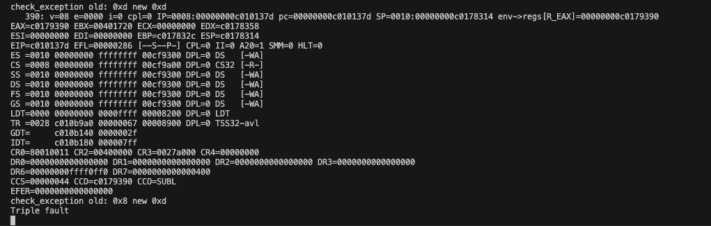
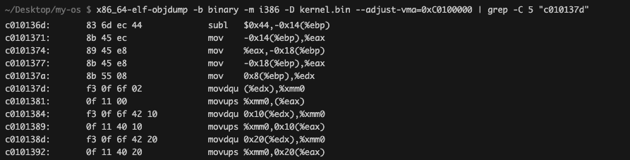
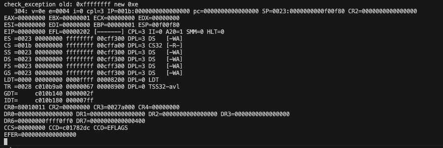
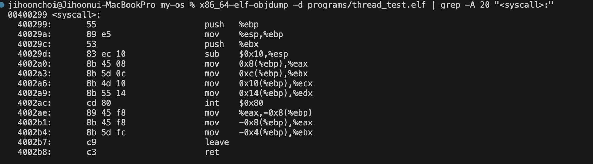
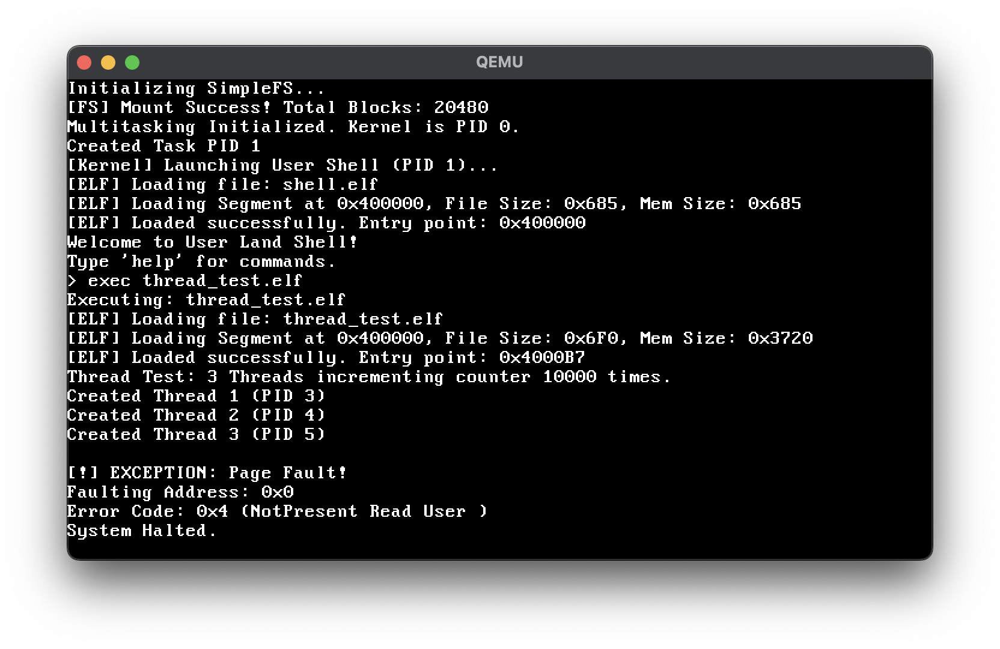
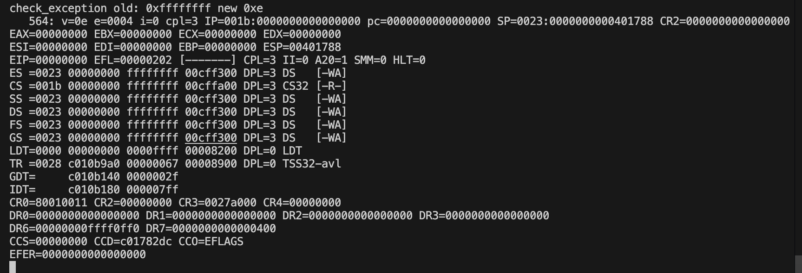
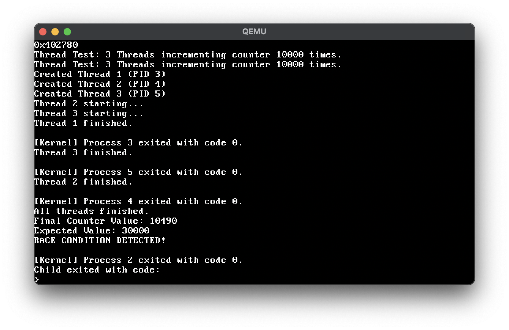
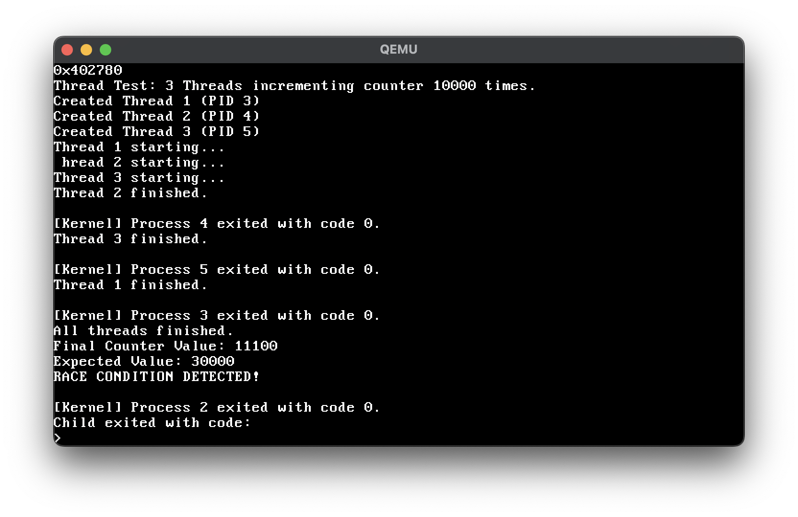

# Debugging Log: `simplefs.c` Kernel Crash

**Date:** 2026-01-20
**Module:** File System (`fs/simplefs.c`)
**Severity:** Critical (Kernel Panic/Hang)

## 1. Issue Description
- **Symptom:** The OS would hang or crash silently when attempting to execute a file (`exec hello.elf`).
- **Observation:** The shell command `exec` was issued, but no output appeared, and the system became unresponsive.

## 2. Debugging Process (Binary Search)
To isolate the exact line causing the crash, I inserted infinite loops (`while(1);`) at strategic points in the code.

1.  **Hypothesis 1:** Crash during ELF loading (`elf_load`).
    - *Result:* The code reached `elf_load` but crashed earlier in `fs_find_file`.
2.  **Hypothesis 2:** Crash inside `fs_find_file`.
    - *Test A:* Loop inserted *before* `*out_inode = *current_inode;`.
        - -> **Reached.** (System hung at the expected loop).
    - *Test B:* Loop inserted *after* `*out_inode = *current_inode;`.
        - -> **Never Reached.** (System crashed before hitting the loop).
    - **Conclusion:** The crash occurs exactly at the struct assignment line.

## 3. Root Cause Analysis
- **Code:** `*out_inode = *current_inode;`
- **Context:** `sfs_inode` is defined with `__attribute__((packed))`.
- **Mechanism:**
    - Packed structures may not be aligned to 4-byte boundaries.
    - When assigning a large packed structure (256 bytes), GCC tries to ensure safe copying by generating a call to `memcpy`.
    - **Problem:** Our OS kernel is *freestanding* and does not have a linked standard C library (`libc`), so `memcpy` is undefined.
    - **Outcome:** The CPU attempted to jump to a non-existent function or executed garbage code, leading to a Page Fault or Hang.

## 4. Resolution
- **Fix:** Replaced the implicit struct assignment with a manual, byte-wise memory copy function.
- **Implementation:**
  ```c
  // Replaced: *out_inode = *current_inode;
  memory_copy((char*)current_inode, (char*)out_inode, sizeof(sfs_inode));
  ```
- **Verification:** After applying the fix and removing debug loops, the `exec` command successfully loaded and executed the user program.

---

# Debugging Log: Userland Shell & Syscall Issues

**Date:** 2026-01-21
**Module:** User Mode, VMM, Syscall, Keyboard Driver
**Severity:** Blocking (Shell Unusable)

## 1. Issue: Page Fault immediately after loading Shell
- **Symptom:** After `elf_load("shell.elf")` and jumping to User Mode, a Page Fault occurred at `0xF01000`.
- **Observation:** The VMM log showed `Mapped User Stack at 0xF00000` (4KB).
- **Root Cause:** The user stack pointer (`ESP`) was initialized to `0xF01000`. Accessing the stack (pushing return addresses or local variables) immediately crossed the boundary of the single 4KB page or touched the unmapped top address.
- **Resolution:**
    - Expanded User Stack mapping in `mm/vmm.c` from 1 page (4KB) to 4 pages (16KB, `0xF00000` - `0xF04000`).

## 2. Issue: Garbled Output ("S S")
- **Symptom:** Shell tried to print "Welcome..." but only "S S" appeared.
- **Root Cause:** System Call ABI mismatch.
    - **User Side (`lib.c`):** Passed arguments in a custom order or incomplete registers.
    - **Kernel Side (`syscall.c`):** Expected arguments in standard registers (EBX, ECX, EDX) but received mismatching data.
- **Resolution:** Standardized to a Linux-like ABI.
    - **EAX:** Syscall Number
    - **EBX:** File Descriptor (1=stdout, 0=stdin)
    - **ECX:** Buffer Pointer
    - **EDX:** Length

## 3. Issue: Keyboard Input Not Echoing
- **Symptom:** Typing keys did not produce output, even though `syscall_read` was called.
- **Root Cause:** Incorrect register usage in key mapping. `syscall_read` was reading `EBX` for the buffer pointer, but `EBX` held the File Descriptor (0). The buffer pointer was in `ECX`.
- **Resolution:** Updated `syscall_read` to read the buffer pointer from `ECX`.

## 4. Issue: Keyboard Input Deadlock (Infinite Loop)
- **Symptom:** Even after fixing registers, `getchar()` would hang.
- **Context:**
    ```c
    // drivers/keyboard.c
    while (kb_head == kb_tail) {
        // ... waiting for interrupt ...
        // Stuck here forever!
    }
    ```
- **Root Cause:**
    1.  **Optimization:** The compiler might optimize the loop, assuming `kb_head` and `kb_tail` don't change.
        - -> **Fix:** Added `volatile` to the loop body (`__asm__ volatile("hlt")`) to prevent optimization and save power.
    2.  **Interrupt Masking (Critical):** The System Call IDT gate was set to `0xEE` (Interrupt Gate).
        - **Mechanism:** `0xEE` automatically clears the Interrupt Flag (`IF=0`) upon entry.
        - **Outcome:** While waiting in the `while` loop inside the syscall, hardware interrupts (Key Press) were ignored by the CPU. The handler never ran, so `kb_head` never updated.
- **Resolution:**
    - Changed IDT Gate `128` (Syscall) to `0xEF` (**Trap Gate**).
    - **Effect:** Trap Gates do *not* clear interrupts on entry. This allows hardware interrupts to preempt the syscall handler, updating the keyboard buffer and breaking the `while` loop.

---

# Debugging Log: sys_fork Implementation Issues

**Date:** 2026-01-26
**Module:** Process Manager (`kernel/process.c`), VMM
**Severity:** Critical (System Reset/Crash)

## 1. Issue: Race Condition in Process State Update
- **Symptom:** Executing `exec hello.elf` caused the screen to flicker rapidly and return to the shell immediately, indicating a crash or reset.
- **Investigation:** Used binary search with `while(1)` loops to pinpoint the crash location. Discovered that the crash occurred immediately after `processes[child_pid].state = PROCESS_READY;`. Verified that `child_pid` was valid.
- **Root Cause:** The process state was set to `PROCESS_READY` *before* the child process's kernel stack (Trap Frame) was fully initialized. The Timer Interrupt fired immediately after this line, causing the scheduler to pick the uninitialized child process. The CPU then attempted to switch context using garbage stack values, leading to a crash.
- **Resolution:** Moved the `PROCESS_READY` assignment to the very end of `sys_fork`, ensuring the child process is fully initialized before becoming eligible for scheduling.

## 2. Issue: Implicit memcpy in Struct Assignment
- **Symptom:** After fixing Issue 1, the kernel crashed again at a different location.
- **Investigation:** Again used `while(1)` binary search and identified the line `*child_regs = *regs;` as the culprit.
- **Root Cause:** In C, assigning one struct to another (e.g., `*child_regs = *regs`) often triggers an implicit call to `memcpy`. Since the kernel is compiled in **freestanding mode** (`-ffreestanding`), the standard library `memcpy` is not linked/available, causing a runtime error (undefined symbol or jump to invalid address).
- **Resolution:** Replaced the struct assignment with a manual loop to copy data element by element:
    ```c
    uint32_t *src_ptr = (uint32_t*)regs;
    uint32_t *dst_ptr = (uint32_t*)child_regs;
    for (int i = 0; i < sizeof(registers_t) / 4; i++) {
        dst_ptr[i] = src_ptr[i];
    }
    ```

---

# Debugging Log: Triple Fault & PMM-VMM Aliasing Analysis

**Date:** 2026-01-26 ~ 2026-01-27
**Module:** Memory Manager (PMM/VMM), Scheduler, Interrupts
**Severity:** Blocker (Triple Fault / Infinite Reboot)

## 1. Issue: Reboot upon `hello.elf` Return (ESP Issue)
- **Symptom:** `hello.elf` executed prints successfully but the system rebooted when returning to the shell (lost output).
- **Investigation:** Tracing revealed that the shell ran as PID 0 (Kernel Task role), so `init_multitasking` did not initialize its `esp`. Upon returning from syscall, the context switch loaded an invalid ESP, causing a Double/Triple Fault.
- **Resolution:** Modified `create_task()` to explicitly initialize the User Shell as PID 1 with a valid stack. PID 0 was delegated to be the Kernel Idle Task.

## 2. Issue: Persistent Triple Fault (CR2=0x10xxx)
- **Symptom:** Even after fixing the ESP issue, executing `exec` caused a Triple Fault (System Reboot).
- **Investigation:** 
    1.  **QEMU Debugging:** Used `-d int,cpu_reset -no-reboot` to capture the crash state.
        
    2.  **State Analysis:** 
        - `CR3`: Pointed to the NEW Page Directory (Child Process).
        - `CR2`: `0x10xxxx` (Kernel Code Access).
        - **Meaning:** The Child Process seemingly lost access to the Kernel Code region (0-4MB mapping vanished), causing a Page Fault that escalated to Triple Fault.
    3.  **Debug Prints:** Inserted code in `vmm_clone_directory` to print `Src[0]` (Kernel Dir) vs `Dst[0]` (Child Dir).
        - `Src[0]`: Valid (`0x118xxx`).
        - `Dst[0]`: Valid (`0x118xxx`). **(Confusing: Logic seemed correct)**.
        - **Clue:** The `Clone Dir` Address itself was `0x523000` (~5MB).
    4.  **Root Cause:** **PMM/VMM Aliasing**. The VMM initialization (`vmm_init`) statically mapped physical addresses **4MB-8MB** for User Text usage. However, it *did not allocate* these frames from the PMM.
        - **PMM:** Believed 5MB was "Free".
        - **VMM:** Believed 5MB was "User Space".
        - **Conflict:** PMM allocated 5MB (`0x523000`) for the **Page Directory**. Later, operations targeting the User Space (4MB+) overwrote this memory region, corrupting the Page Directory structure (specifically erasing the Kernel Mappings at Index 0).
    5.  **Resolution:**
        1.  **PMM Reservation:** Updated `pmm_init` to reserve **0-16MB** as "Used". Only high memory (16MB+) is now allocated dynamically.
        2.  **Identity Mapping Extension:** Updated `vmm_init` to Identity Map up to 128MB, allowing the kernel to access high-memory frames.
        3.  **Outcome:** Triple Fault resolved. `fork()` and `exec()` now function stably.

---

# Debugging Log: VMM Initialization Page Fault & TLB Coherence

**Date:** 2026-02-04
**Module:** VMM (`mm/vmm.c`)
**Severity:** Critical (Page Fault at 0xC011D000)

## 1. Issue: Page Fault during VMM Initialization
- **Symptom:** The kernel immediately triggered a Page Fault at `0xC011D000` during initialization.
    

## 2. Debugging Process: Tracing the Phantom Crash
1.  **Narrowing Down:** Inserted `while(1)` loops to locate the failure point. The crash occurred specifically at the line:
    ```c
    linear_mapping_tables[i].m_entries[j] = frame_phys | I86_PTE_PRESENT | I86_PTE_WRITABLE;
    ```
2.  **Address Verification:** Used `print_hex` to identify the address `0xC011D000`. Confirmed that this address corresponds to `linear_mapping_tables` itself (which is in the kernel's `.bss` section).
3.  **The "Dummy Value" Experiment:**
    - To test if *any* write would succeed, I inserted `linear_mapping_tables[i].m_entries[0] = 1;` before the loop.
    - **Result:** The loop ran to completion without crashing (though it filled garbage). This behavior was strange: adding a write *before* the crash loop effectively "fixed" the crash.

## 3. Root Cause Analysis: TLB & Page Table Mapping Order
- **Symptom Analysis:** Why did the dummy write prevent the crash?
    - I consulted the **Intel SDM** and investigated TLB behavior.
    - My hypothesis: When `linear_mapping_tables[i].m_entries[0] = 1;` is executed, the CPU caches the *current* valid translation (from `head.asm`) into the TLB. The subsequent loop then hits the TLB instead of walking the incomplete page table.
- **Code Trace:**
    - I analyzed the original code flow:
        ```c
        // 1. Register PDE (Door Open)
        kernel_directory->m_entries[start_pde_index + i] = table_phys | ...;
        // 2. Fill PTEs (Room Setup)
        linear_mapping_tables[i].m_entries[j] = frame_phys | ...;
        ```
    - **Fatal Flaw:**
        - `linear_mapping_tables` exists in the very memory region (0xC0xxxxxx) that I am re-mapping.
        - By registering the PDE *first*, I overwrote the existing valid mapping (from `head.asm`) with a pointer to an *empty* page table.
        - When the next line tried to write to `linear_mapping_tables`, the CPU tried to translate `0xC0xxxxxx`, saw the new PDE, looked into the empty table, and crashed with a Page Fault (Not Present).

## 4. Resolution: Commit-Reveal Pattern
- **Fix:** Swapped the order of operations to ensure the page table is fully populated *before* being linked to the directory.
    ```c
    // 1. Fill Table First (while old mapping keeps us safe)
    for (int j = 0; j < 1024; j++) {
        uint32_t frame_phys = ...;
        linear_mapping_tables[i].m_entries[j] = frame_phys | ...;
    }
    // 2. Register PDE (Atomic Switch)
    kernel_directory->m_entries[start_pde_index + i] = table_phys | ...;
    ```
- **TLB Invalidation:**
    - Acknowledged that TLB behavior caused the phantom debugging results.
    - Consulted **Intel SDM 5.10.4.1** ("Operations that Invalidate TLBs and Paging-Structure Caches").
    - Added an explicit CR3 reload to enforce TLB consistency after the update:
    ```c
    uint32_t pd_phys = V2P((uint32_t)kernel_directory);
    __asm__ volatile("mov %0, %%cr3" : : "r"(pd_phys) : "memory");
    ```
- **Outcome:** The kernel now initializes correctly, maintaining safe access to its own memory structures throughout the process.

---

# Debugging Log: PMM Memory Corruption & Buffer Overflow

**Date:** 2026-02-04
**Module:** PMM (`mm/pmm.c`)
**Severity:** Critical (System Reboot / Memory Corruption)

## 1. Issue Description
- **Symptom:** After fixing the VMM crash, the kernel printed "PMM: Reserved Low Memory up to Kernel End" and then silently shutted down.
- **Observation:** The expected log from the subsequent code block was missing, indicating a crash or state corruption immediately after the reservation loop.
    

## 2. Debugging Process
1.  **Binary Search:** Inserted `print_dec` and `while(1)` calls to inspect variable values.
    - Result: `end_reserved_block` was found to be `-1` (`0xFFFFFFFF`).
2.  **Backtracing:** Traced the source of this value.
    - `end_reserved_block` gets its value from `total_memory_blocks`.
    - `total_memory_blocks` was behaving normally *before* the reservation loop, but became `-1` *after* the loop.
3.  **Hypothesis:** The PMM loop `for (i=0; i<reserved_limit_block; i++) mmap_set(i);` was somehow corrupting the `total_memory_blocks` variable.
4.  **Memory Layout Analysis:**
    - Confirmed in `pmm.c` that `total_memory_blocks` is defined immediately after `memory_bitmap`.
    - `mmap_set(i)` sets bits to 1.
    - `-1` in integer representation is `0xFFFFFFFF` (all bits 1).
    - **Conclusion:** A Buffer Overflow in `memory_bitmap` was spilling over into `total_memory_blocks`, overwriting it with 1s.

## 3. Root Cause Analysis
- **Code:** `uint32_t reserved_end = kernel_end;`
- **Context:** `kernel_end` is a symbol provided by the linker script.
- **Mechanism:**
    - In the Higher Half Kernel architecture, `_kernel_end` is linked at a **Virtual Address** (approx `0xC01xxxxx`).
    - The PMM is designed to work with **Physical Addresses** (indices into the bitmap).
    - **Fatal Error:** The code treated the virtual address (~3,222,xxx,xxx) as a physical index.
    - **Result:** The loop tried to reserve 3 billion blocks. This far exceeded the size of `memory_bitmap` (32KB), causing a massive overwrite of adjacent global variables in the `.bss` section.

## 4. Resolution
- **Fix:** Explicitly converted the virtual address to a physical address before using it in PMM calculations.
- **Implementation:**
  ```c
  // Convert Virtual (0xC0xxxxxx) to Physical (0x0xxxxxxx)
  uint32_t kernel_end_phys = kernel_end - 0xC0000000;
  uint32_t reserved_limit_block = (kernel_end_phys + PMM_BLOCK_SIZE - 1) / PMM_BLOCK_SIZE;
  ```
- **Outcome:** The PMM initialized correctly, reserving only the actual physical memory used by the kernel (approx 1MB range), and the system boot continued without corruption.

---

# Debugging Log: User Mode Stack Alignment & Page Fault

**Date:** 2026-02-10
**Module:** User Mode (`kernel/process.c`, `programs/shell.c`), GCC Toolchain
**Severity:** Critical (User Program Crash)

## 1. Issue Description
- **Symptom:** A Page Fault occurred at `0xF01000` immediately after launching `shell.elf` (User Mode).
- **Observation:**
    - `0xF01000` is the start of an unmapped page (User Stack is mapped at `0xF00000`~`0xF00FFF`).
    - Using `while(1)` binary search confirmed the crash happens exactly at the entry of `shell.o`.
    - Even after changing the initial `ESP` to `0xF00FFF` (inside the valid page), the Page Fault persisted at the same address (`0xF01000`).
    - This was puzzling because `main()` in `shell.c` takes no arguments (`void main()`), so logically it shouldn't be reading from the stack.

## 2. Debugging Process: Disassembling the Truth
To understand why the CPU was accessing memory I didn't tell it to, I analyzed the compiler-generated assembly.

1.  **Command:** `x86_64-elf-gcc -ffreestanding -m32 -c programs/shell.c -o shell.o`
2.  **Disassembly:** `x86_64-elf-objdump -d -M intel shell.o`
3.  **Result (The "Smoking Gun"):**
    ```nasm
    00000000 <main>:
       0:   8d 4c 24 04             lea    ecx,[esp+0x4]
       4:   83 e4 f0                and    esp,0xfffffff0
       7:   ff 71 fc                push   DWORD PTR [ecx-0x4]  <-- The crashing instruction
    ```

## 3. Root Cause Analysis: GCC's Hidden "Prologue"
- **The "Why":** Modern x86 CPUs require the Stack Pointer (`ESP`) to be **16-byte aligned** to efficiently execute SIMD instructions (like `SSE`, `movaps`). If not aligned, these instructions trigger a General Protection Fault.
- **The "How":** GCC, by default, inserts a "Prologue" at the start of `main` to enforce this alignment.
    1.  `lea ecx, [esp+4]`: Calculates the address where the "Return Address" *should* be.
    2.  `and esp, -16`: Aligns the `ESP` downwards to the nearest 16-byte boundary.
    3.  `push [ecx-4]`: Copies the 4-byte Return Address from the old stack position to the new aligned position.
- **The Crash Mechanism:**
    - **My Setup:** I initialized `ESP` to `0xF00FFF`.
    - **The Instruction:** `push DWORD PTR [ecx-4]` tries to read 4 bytes from `0xF00FFF`.
    - **Physical Reality:**
        - Byte 1: `0xF00FFF` (Mapped, OK).
        - Byte 2: `0xF01000` (Unmapped, **Page Fault**).
        - Byte 3: `0xF01001` (Unmapped).
        - Byte 4: `0xF01002` (Unmapped).
    - **Conclusion:** The GCC prologue blindly assumed it could read a full 4-byte Return Address, causing a Cross-Page Read into invalid memory.
- **The "Ghost" Data:**
    - Since I enter User Mode via `IRET` (not `CALL`), there is no actual Return Address on the stack.
    - GCC, assuming `main` is called like any C function, attempts to preserve this non-existent return address.
    - It blindly reads from `[ESP]`, crashing into the unmapped page boundary.

## 4. Resolution
- **Fix:** Adjusted initial User `ESP` to **`0xF00FFC`**.
- **Rationale:**
    - By setting `ESP` to `0xF00FFC` (4-byte aligned), the `push` instruction reads exactly 4 bytes (`0xF00FFC`~`0xF00FFF`).
    - These 4 bytes are fully within the mapped page, so the read succeeds (even if the value is garbage/zero).
    - The "ghost" return address (garbage) is safely pushed to the aligned stack, preserving GCC's assumption without crashing.
- **Outcome:** The shell launches successfully without crashing.

---

# Debugging Log: COW Memory Corruption Due to Write Protection

**Date:** 2026-02-13
**Module:** Memory Manager (VMM, COW), CPU Architecture (CR0 Register)
**Severity:** Critical (Parent Process Memory Corruption)

## 1. Issue Description
- **Symptom:** Executing `exec hello.elf` caused the child process to run successfully, but the system crashed with a Page Fault immediately after the child exited, failing to return to the shell.
- **Hypothesis:** Since the code finished but return failed, it seemed like a Scheduler or Context Switch bug.
- **Initial Attempt:** Using `while(1)` loops was ineffective because the crash happened during the delicate transition from Child to Parent.

## 2. Debugging Process: Capturing the Crash State
1.  **QEMU Debugging:** Used `qemu-system-x86_64 -d int,cpu_reset -no-reboot` to freeze the CPU state at the exact moment of the crash.
2.  **Crash Analysis:**
    
    - **CR2 (Fault Address):** `0x467C0BA1` (Invalid/Unmapped Address)
    - **CR3 (Page Directory):** `0x0027F000` (Verified to be the Shell's Page Directory)
    - **EIP (Instruction Pointer):** `0x00400299`
    

3.  **Address Verification:**
    - Confirmed via `objdump` that `0x400299` is a valid address within `shell.elf`.
    - However, the instruction at `0x400299` in `shell.elf` should NOT be accessing `0x467C0BA1`. There was no logical reason for this access in the source code.
    

## 3. Root Cause Analysis: The Smoking Gun
- **Contradiction:** The code address (`EIP`) was valid for Shell, but the behavior (accessing `CR2`) was impossible for Shell's code.
- **Hypothesis:** The memory at `0x400299` must have been corrupted/overwritten by `hello.elf`.
- **Cross-Examination:**
    - I checked `hello.elf`'s disassembly at the same offset (`0x40029x`).
    
    - Found instruction sequence: `45 fc 01 8b 55 fc 8b 45`
    - **Decoded Instruction:** `add DWORD PTR [ebx+0x458bfc55], ecx`
    - **Manual Verification:**
        - `EBX` at crash: `0x00F00F4C`
        - Calculation: `0x00F00F4C` + `0x458BFC55` = **`0x467C0BA1`**
    - **Conclusion:** **Exact Match!** The Shell was executing `hello.elf`'s code logic inside its own address space.

- **The "Why":**
    - **COW Failure:** The Parent (Shell) and Child (Hello) shared the same physical frame (COW).
    - **Kernel Trap:** When `exec` loaded `hello.elf`, it wrote to this shared frame.
    - **Missing Protection:** The Kernel (Ring 0) ignored the Read-Only bit because the **Write Protect (WP)** bit in the **CR0** control register was **0** (Disabled).
    - **Result:** The Kernel overwrote the shared physical frame directly, destroying the Parent's code.

## 4. Resolution
- **Fix:** Enabled the Write Protect (WP) bit in the CR0 register during kernel initialization.
- **Implementation (head.asm):**
    ```nasm
    mov eax, cr0
    or eax, 0x80010000 ; Set PG (Bit 31) and WP (Bit 16)
    mov cr0, eax
    ```
- **Outcome:** The CPU now strictly enforces Read-Only protection even for the Kernel. `exec` triggers a Page Fault as intended, activating the COW mechanism to allocate a new private frame for the Child. The Shell creates a child, waits, and resumes successfully.


---

# Debugging Log: Kernel Heap Corruption in ELF Loader

**Date:** 2026-02-13
**Module:** Heap Manager (`mm/kheap.c`), ELF Loader (`kernel/elf.c`), ATA Driver (`drivers/ata.c`)
**Severity:** Critical (Memory Corruption / Kernel Panic)

## 1. Issue Description
- **Symptom:** After successfully executing `hello.elf`, running a subsequent command like `exec fork_cow.elf` caused the kernel to panic with `KHEAP CORRUPTION DETECTED!`.
- **Observation:** The failure occurred inside `kmalloc` when trying to allocate memory for the second program. This indicated that the heap structure (metadata) had been damaged during the previous operations.
    

## 2. Debugging Process: Tracing the Overflow
1.  **Isolation:** The crash happened during `exec fork_cow.elf`, specifically when `elf_load` called `kmalloc`.
2.  **Heap Inspection:** `kmalloc` traverses the free list and checks a `MAGIC` number in each block header. The panic meant a header was overwritten with garbage.
3.  **Suspect:** The most recent heavy memory operation was loading `hello.elf`.
4.  **Code Review (`kernel/elf.c`):**
    ```c
    // Calculating allocation size
    char *file_buffer = (char*)kmalloc(inode.size);
    // Reading file
    fs_read_file(&inode, file_buffer);
    ```
5.  **Data Flow Analysis:**
    - `inode.size`: The exact size of the file (e.g., 200 bytes).
    - `kmalloc(200)`: Allocates a block slightly larger than 200 bytes and places a **Block Header** for the *next* free block immediately after it.
    - `fs_read_file` -> `ata_read_sector`: The ATA driver reads data in **512-byte Chunks (Sectors)**.

## 3. Root Cause Analysis: The Sector Size Mismatch
- **Mechanism:**
    - The file `hello.elf` was small (e.g., 200 bytes).
    - `kmalloc` allocated memory for exactly 200 bytes.
    - `ata_read_sector` read the full 512-byte sector into this buffer.
    - **Buffer Overflow:** The remaining 312 bytes (garbage/padding from the disk sector) were written *past* the end of the allocated buffer.
- **Impact:** This overflow overwrote the **Next Heap Block's Header** (Magic Number, Size, Links).
- **Delayed Failure:** The corruption went unnoticed until `exec fork_cow.elf` called `kmalloc` again. The allocator tried to read the next block ("Is this block free?"), encountered the garbage header, and triggered the corruption panic.

## 4. Resolution
- **Fix:** Modified `elf_load` in `kernel/elf.c` to round up the allocation size to the nearest 512-byte alignment.
- **Implementation:**
    ```c
    // Round up to 512 bytes (Sector Size)
    uint32_t aligned_size = ((inode.size + 511) / 512) * 512;
    char *file_buffer = (char*)kmalloc(aligned_size);
    ```
- **Outcome:** The buffer is now large enough to hold the full sector data (including padding). The ATA driver writes safely within bounds, preserving the heap integrity. Multiple `exec` calls now run firmly without corruption.


---

# Debugging Log: Triple Fault in `thread_test.elf` (SSE Instruction)

**Date:** 2026-02-17
**Module:** User Mode Execution (`programs/thread_test.c`), Compiler Flags
**Severity:** Critical (System Reboot / Triple Fault)

## 1. Issue Description
- **Symptom:** Executing `exec thread_test.elf` caused an immediate Triple Fault, leading to a system reboot (QEMU reset).
- **Observation:**
    - The program loaded successfully (ELF loader printed entry point).
    - But as soon as it started running (possibly during thread creation or early execution), the CPU reset.
    - No specific error message (Page Fault, GPF) was visible before the reset with standard logging.

## 2. Debugging Process: Capturing the Crash State
To understand the cause of the Triple Fault, I utilized QEMU's advanced debugging features to capture the CPU state at the moment of the crash.

1.  **QEMU Debug Flags:**
    - Added `-d int,cpu_reset -no-shutdown` to the QEMU command in `Makefile`.
    - `-d int`: Logs interrupts and exceptions.
    - `-cpu_reset`: Logs CPU state on reset.
    - `-no-shutdown`: Keeps the QEMU window open after the crash instead of exiting.
    
    ```makefile
    qemu-system-x86_64 -no-reboot -d int,cpu_reset -no-shutdown -drive format=raw,file=disk.img
    ```

2.  **Crash Analysis (Register Dump):**
    - The QEMU log revealed that the CPU was halted due to a **Triple Fault**.
    - **EIP (Instruction Pointer):** `0xC010137D`
    - This address points to the exact instruction that caused the exception.

    
    *(The register dump showing EIP=0xC010137D)*

## 3. Root Cause Analysis: Disassembling the Kernel
The address `0xC010137D` is a virtual address in the Kernel's code segment. To find out what instruction resides there, I used `objdump`.

1.  **Disassembly Command:**
    - `x86_64-elf-objdump -b binary -m i386 -D kernel.bin --adjust-vma=0xC0100000 | grep -C 5 "c010137d"`
    - **`--adjust-vma=0xC0100000` (Crucial):** Since `kernel.bin` is a raw binary (not ELF), it has no internal address information. By default, `objdump` assumes it starts at `0x0`. However, our kernel is linked to run at `0xC0100000` (Higher Half). This option tells `objdump` to offset all addresses by `0xC0100000`, matching the crash log addresses.

2.  **Disassembly Result:**
    ```asm
    c010137d:       f3 0f 6f 02             movdqu (%edx),%xmm0
    ```
    
    *(Objdump output revealing the culprit instruction)*

3.  **The "Smoking Gun":**
    - **Instruction:** `movdqu` (Move Unaligned Double Quadword).
    - **Type:** **SSE (Streaming SIMD Extensions)** instruction.
    - **Register:** `%xmm0` (SSE Register).
    - **Cause:** The compiler (GCC), trying to optimize a structure copy or memory operation (likely `*child_regs = *regs` in `sys_clone`), generated an SSE instruction.
    - **Why Crash?**
        - In the protected mode OS, I have **not enabled SSE** in the CR4 register.
        - Executing any SSE instruction without enabling it triggers an **Invalid Opcode (#UD)** exception.
        - If the exception handler itself is not set up to handle this or triggers another fault (e.g., stack alignment), it escalates to a Double/Triple Fault.

## 4. Resolution: Disabling SSE Generation
Since the kernel does not yet support SSE/FPU context switching, the safest fix is to forbid the compiler from generating these instructions.

- **Fix:** Added GCC flags to disable SSE, SSE2, and MMX.
- **Affected Files:** `Makefile` (both Kernel and User Program compilation rules).
- **Implementation:**
    ```makefile
    # Kernel CFLAGS
    CFLAGS = -ffreestanding -m32 -g ... -mno-sse -mno-sse2 -mno-mmx

    # User Program Rule
    programs/%.elf: ...
        $(CC) ... -mno-sse -mno-sse2 -mno-mmx
    ```

- **Outcome:** After recompiling (`make clean && make run`), the Triple Fault disappeared, and `thread_test.elf` proceeded past the crash point (though it later revealed a separate stack frame issue).


---

# Debugging Log: Child Thread Page Fault (Stack Frame Issue)

**Date:** 2026-02-19
**Module:** Thread Management (`programs/lib.c`, `kernel/process.c`), Assembly
**Severity:** Critical (Child Thread Crash)

## 1. Issue Description
- **Symptom:** Executing `exec thread_test.elf` resulted in a Page Fault at Address `0x0`.
- **Observation:**
    - To trace the execution flow, I added `print_dec()` calls inside `thread_create` to check the return value of the syscall.
    - Expected behavior: The child thread (returned 0) should print something or execute the function `func`.
    - Actual behavior: No output from the child thread. It crashed silently before running user code.
    - This indicated that the child thread failed to return correctly from the `clone` system call to the `thread_create` function.

## 2. Debugging Process: Register Dump & Stack Analysis
To understand why the return failed, I inspected the CPU state at the crash.

1.  **Register Dump Analysis:**
    - **EIP:** `0x00000000` (Jumped to NULL).
    - **ESP:** `0x00F00F80` (Parent's Main Stack!).
    
    
    *(ESP pointing to 0xF00F80, which is the Main Thread's stack)*

2.  **Contradiction:**
    - The `thread_test.elf` is loaded at `0x400000`.
    - The child thread's stack was statically allocated in the BSS section (`stack1`, `stack2`, etc.), so its ESP should be around `0x40xxxx`.
    - Debug prints confirmed that the stack pointer passed to `clone` was indeed `0x40xxxx`.
    - **Question:** Why did ESP revert to the Parent's Stack (`0xF00F80`) at the moment of the crash?

3.  **Hypothesis:**
    - **Is the Main Thread causing the crash after it finishes?**
    - To verify this, I inserted dummy loops (`for(i=0; i<big_number; i++)`) in the main thread to delay its completion.
    - **Result:** The Page Fault occurred *while* the dummy loops were still running.
    - **Conclusion:** This confirmed that the crash happens when the **Scheduler preempts the Main Thread** and attempts to switch context to the Child Thread. It is not a logic error in the Main Thread's cleanup code, but a failure in the context switching or stack restoration process.

## 3. Root Cause Analysis: The `leave` Instruction
Since C code hides stack manipulations, I disassembled the `syscall` function (implemented in `programs/lib.c`) within the `programs/thread_test.elf` binary to see the raw assembly.

1.  **Disassembly Command:**
    - `x86_64-elf-objdump -d programs/thread_test.elf | grep -A 20 "<syscall>:"`

2.  **Disassembly Result:**
    ```asm
    4002ae:       89 45 f8                mov    %eax,-0x8(%ebp)
    4002b1:       8b 45 f8                mov    -0x8(%ebp),%eax
    4002b4:       8b 5d fc                mov    -0x4(%ebp),%ebx
    ...
    400446:       c9                      leave
    400447:       c3                      ret
    ```
    

3.  **The "Smoking Gun": `LEAVE`**
    - The `leave` instruction is equivalent to:
      ```asm
      mov esp, ebp
      pop ebp
      ```
    - **Missing Piece:** In `sys_clone`, I correctly updated `ESP` to the new stack, but **I forgot to update `EBP`**.
    - **Result:**
        - `EBP` still held the **Parent's Stack Address** (`0xF0xxxx`).
        - When the child thread executed `leave`, `mov esp, ebp` overwrote the correct new stack pointer (`0x40xxxx`) with the parent's stack pointer (`0xF0xxxx`).
        - The subsequent `ret` popped a garbage return address from the parent's stack, causing a jump to `0x0`.

## 4. Resolution
To fix the ESP reversion issue, I modified `sys_clone` to explicitly update the child's `EBP` to the new stack pointer.

- **Fix:** Set `child_regs->ebp` to the new stack pointer.
- **Implementation (kernel/process.c):**
    ```c
    if (regs->ebx != 0) {
        child_regs->useresp = regs->ebx;
        child_regs->ebp = regs->ebx; // <--- Added this line
    }
    ```
- **Outcome:**
    - A Page Fault still occurred, BUT...
    - **The Register Dump showed ESP = `0x40xxxx`!**
    - This confirmed that the stack pointer now correctly points to the User Stack at the time of the crash.


---

# Debugging Log: Child Thread Page Fault (Empty User Stack & Context Restoration)

**Date:** 2026-02-20
**Module:** Thread Management (`programs/lib.c`, `kernel/process.c`)
**Severity:** Critical (Child Thread Page Fault on Startup)

## 1. Issue Description
- **Symptom:** Executing `exec thread_test.elf` caused an immediate Page Fault (Error Code 0x4) before the child thread could perform any of its expected functionality.
- **Observation:**
    
    - The fault occurred entirely before the user thread's logic began executing, indicating an issue during the transition from the `sys_clone` system call back to User Mode.

## 2. Debugging Process: Register Dump & Stack Trace Analysis
1.  **Register Dump Verification:**
    
    - **CR2 & EIP:** Both were exactly `0x0`. This means the CPU attempted to fetch and execute an instruction from address `0x0`.
    - **ESP (Stack Pointer):** Showed values like `0x401728` or `0x401788`. This matched the dynamically assigned User Stack addresses for the new child threads.
    
2.  **Stack Direction Analysis:**
    - I printed out the base addresses of the user thread stacks (`stack1`, `stack2`, `stack3`). One of them was around `0x401780`.
    - The x86 stack grows downwards (from higher memory to lower memory).
    - If the thread actually ran and pushed data, the `ESP` should be *lower* than the initial boundary `0x401780`.
    - However, the faulting `ESP` (`0x401788`) was actually *higher* than the initial stack pointer.
    - **Conclusion:** A hardware page fault accessing a higher stack address indicates the CPU was likely trying to `pop` a return address or read arguments placed by a caller, rather than pushing local variables.

3.  **Code Tracing & Root Cause Formulation:**
    - I traced the code flow: The parent thread calls `int 0x80` (`syscall`).
    - The kernel duplicates the trap frame in `sys_clone`.
    - When the child thread is scheduled, the kernel does an `IRET`, dropping the child thread right back into the C `syscall()` wrapper function's epilogue (specifically, the `leave` and `ret` instructions).
    - **The Fatal Flaw:** The child thread wakes up holding a completely empty, newly allocated stack. When the C function epilogue executes `ret`, it pops the top of this empty stack expecting a return address. Since the stack is zeroed out, it pops `0x0` into `EIP` and jumps to it, causing the immediate Page Fault.

## 3. Resolution: Fake Stack Injection & EIP Modification
Instead of having the child thread return to the `syscall` wrapper and branch off like in `fork()`, the solution is to manipulate the trap frame so the child wakes up directly inside its target function.

1.  **Injecting User Stack Data (Parent Side - `programs/lib.c`)**
    - Before calling `sys_clone`, the parent manually constructs a fake stack frame (cdecl calling convention) on the child's new stack.
    ```c
    int *user_stack = (int *)stack;
    
    // Setup initial stack frame for the thread
    *(--user_stack) = 0;               // Dummy argument (for exit)
    *(--user_stack) = (int)arg;        // Argument for func
    *(--user_stack) = (int)exit;       // Return address (thread will call exit() when func returns)
    
    // Pass user_stack via EBX, func entry point via ECX
    int ret = syscall(10, (int)user_stack, (int)func, 0);
    ```
    - *Note on the fake return mechanism:* When the worker function `func` finishes and hits its `ret` instruction, it will pop `(int)exit` as its return address. When `exit(code)` begins executing, it will pop the `(int)arg` slot thinking it is the return address, and read the `0` slot as its `code` argument. Since `exit()` invokes `sys_exit` and never actually returns, misinterpreting the `arg` slot as a return address is perfectly safe.

2.  **Modifying the Trap Frame (Kernel Side - `kernel/process.c`)**
    - The kernel intercepts the custom stack frame and entry point provided by the parent via registers `EBX` and `ECX`.
    ```c
    // Set New Stack Pointer (passed in EBX)
    if (regs->ebx != 0) {
        child_regs->useresp = regs->ebx; // Set User ESP in Trap Frame
        child_regs->ebp = 0;             // Clear EBP for clean stack trace
    }
    
    // Set Thread Entry Point (passed in ECX)
    if (regs->ecx != 0) {
        child_regs->eip = regs->ecx;     // Warp the child directly to 'func'
    }
    ```
    - **Why `EBP = 0`?** Every C function prologue pushes the previous `EBP` to the stack to maintain a linking chain for stack traces. Since this child thread is starting fresh and wasn't literally "called" by any C function, leaving the parent's `EBP` here would intertwine their stack traces. Setting it to `0` (NULL) provides a clean anchor indicating the absolute bottom of the thread's call stack, preventing debuggers from unwinding out of bounds.

## 4. Verification
After applying these fixes, compiling, and running the system, `thread_test.elf` executed completely normally. The threads inherited the pre-filled arguments, successfully executed their workloads, and smoothly returned into the `exit()` system call termination block.




---

# Debugging Log: Race Condition in Shared Page Directory Reference Counting

**Date:** 2026-02-23
**Module:** Process Manager (`kernel/process.c`), VMM (`mm/vmm.c`), PMM (`mm/pmm.c`)
**Severity:** Critical (Potential Memory Corruption / Use-After-Free)

## 1. Issue Description
- **Observation:** While refactoring the multitasking system, a potential race condition and use-after-free scenario were identified regarding shared Page Directories (PD).
- **Initial State:** In `sys_clone()`, threads were assigned the parent's PD (`child->pd = current_process->pd;`) without any reference counting. During termination, `vmm_free_directory()` would unconditionally destroy page tables and free the PD frame.
- **Problem:** If one thread exited while others were still active, the shared memory mappings would be destroyed, causing a crash for the surviving threads.

## 2. Initial Refcounting & Hidden Race Condition
- **Approach:** Introduced physical page reference counting for PD frames.
    - Added `pmm_inc_ref()` in `sys_clone()` to increment the count when a PD is shared.
    - Added a check in `vmm_free_directory()` to decrement the count and skip destruction if `pmm_get_ref() > 1`.
- **The "Hidden" Race Condition:** The `memory_refcounts[frame]++;` operation in `pmm.c` is not atomic at the assembly level.
    - **Assembly Breakdown (Read-Modify-Write):**
        1. `mov eax, [addr]` (Read current count)
        2. `inc eax`        (Modify)
        3. `mov [addr], eax` (Write back)
    - **Scenario:** If a context switch occurs between (1) and (3), two threads might read the same initial value, increment it, and write back the same result. Instead of +2, the count only increases by +1 (Lost Update).
    - **TOCTOU Gap:** Similarly, in `vmm_free_directory()`, a thread could be preempted after checking the count but before decrementing it, leading to inconsistent state.

## 3. Resolution: Kernel Synchronization (IRQ Lock)
- **Fix:** Protected the critical sections in both `sys_clone()` and `vmm_free_directory()` using a kernel-level synchronization primitive.
- **Renaming for Clarity:** Renamed `spinlock_t` to `irq_lock_t` since the implementation on a single-core system uses `cli/sti` (disabling/enabling IRQs) rather than busy-waiting.
- **Implementation:**
    - **In `kernel/process.c` (`sys_clone`):**
      ```c
      irq_lock(&pd_ref_lock);
      child->pd = current_process->pd;
      pmm_inc_ref(V2P((uint32_t)child->pd));
      irq_unlock(&pd_ref_lock);
      ```
    - **In `mm/vmm.c` (`vmm_free_directory`):**
      ```c
      irq_lock(&pd_ref_lock);
      if (pmm_get_ref(dir_phys) > 1) {
          pmm_free_block(dir_phys); 
          irq_unlock(&pd_ref_lock);
          return;
      }
      irq_unlock(&pd_ref_lock);
      ```
- **Outcome:** The shared reference count operations are now atomic. Interrupts are disabled during the entire Check-Then-Act flow, preventing any interleaved execution that could lead to memory corruption or premature resource freeing.

